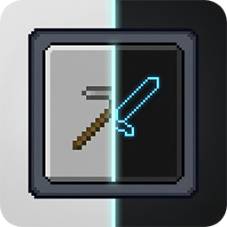

  
    
  
   
  
   
  

# BlxckoutFX

A lightweight Minecraft mod that applies a consistent dark theme to buttons and in-game GUI surfaces using shader-based rendering.

By transforming the default white panels into a sleek custom **mode**, this shader-based solution brings a refined **dark** aesthetic to your interface **everywhere** you look, delivering an eye-friendly experience across all screens.

*Let darkness fall everywhere for your eyes.*

---

## 📖 About

This is my very first Minecraft mod. I originally created it because bright and white Minecraft interfaces were uncomfortable for my eyes. After building it for myself, I decided to share it with other players who might want the same kind of darker GUI experience.

BlxckoutFX is intentionally focused: it changes GUI rendering, not the world itself. Menu backgrounds, the Minecraft logo, and mod images are kept intact, while buttons and in-game GUI panels receive the darkening effect.

---

## ✨ Features

### ⚙️ Core Principles

- **Shader-Based:** The effect is handled through shader rendering instead of replacing vanilla textures.
- **GUI Focused:** The mod targets interface elements only.
- **Lightweight:** It avoids extra systems and keeps the feature set focused.
- **Menu-Safe:** Main menu backgrounds, logos, and mod list images are not darkened.

### 🎮 Mod Details

- **Button Darkening in Menus:** Menu screens darken buttons only.
- **In-Game GUI Dark Theme:** In-game screens can darken both buttons and GUI panels.
- **Shader-Based Visual Styling:** No manual shader setup is required.
- **Loader Support:** Supports NeoForge and Fabric Loader.
- **Draggable FX Button:** The on-screen `FX` button cycles themes on left click and can be moved by holding and dragging.
- **Config Screen:** Toggle the inventory button and adjust its saved position.
- **Readable Text Handling:** Soft, Balanced, and Dark modes use fixed readable text colors for better consistency.

### 🌑 Available Themes / Modes

- **⚪ Off:** Disables the visual effect.
- **🔘 Soft:** A lighter darkening mode for subtle interface dimming.
- **⚫ Balanced:** The default mode, designed for regular use.
- **⬛ Dark:** A stronger darkening mode for brighter interfaces.
- **👁️‍🗨️ Blxckout:** The strongest preset for users who want the darkest look.

---

## 📥 Versions

| Minecraft Version | Loader              | Mod Version | Status           |
|------------------|---------------------|-------------|------------------|
| 26.1.2           | NeoForge + Fabric   | 1.1.0       | Main Release     |
| 1.21.1           | NeoForge + Fabric   | 1.1.0       | Legacy Branch    |
| 1.20.1           | Forge + Fabric      | 1.1.0       | Unsupported Port |
| 1.12.2           | Forge               | -           | In Development   |

---

## 🚀 Installation

1. Install your target Minecraft version via the Minecraft Launcher.
2. Install NeoForge or Fabric Loader.
3. Place the matching BlxckoutFX jar file into the `mods` folder.
4. Launch the game.

> 💡 **Important Version Notice:** The mod prioritizes support for the latest NeoForge and Fabric versions available for its target Minecraft version. If a compatibility issue appears, update to the minimum loader version listed on the release page.

---

## 📂 Branch Structure

- `main` → Minecraft 26.1.2 development
- `1.21.1` → Minecraft 1.21.1 support branch
- `1.20.1` → Minecraft 1.20.1 unsupport branch
- `1.12.2` → Minecraft 1.12.2 backport branch (In Development)

---

## 🛠️ Support & Maintenance Policy

> ⚠️ **Note for 1.20.1:** This specific version has no active support. Issues may be fixed in bulk batches or left as-is depending on necessity.

If you encounter bugs, issues, or have suggestions, you can report them through either of the following channels:

- **GitHub Issues:** Open an issue directly in this repository.
- **Discord Server:** Join the community via [Discord](https://discord.gg/rUD6tynDaK).

When reporting an issue, please include:
- Minecraft version
- Loader and loader version
- BlxckoutFX version
- A short description of what happened
- Screenshots if the issue is visual

---

## 💖 Support Me

If you would like to support the project, you can visit my Patreon page:

👉 [Patreon](https://patreon.com/Lopew)

---

## 📜 License

This project is licensed under the MIT License.